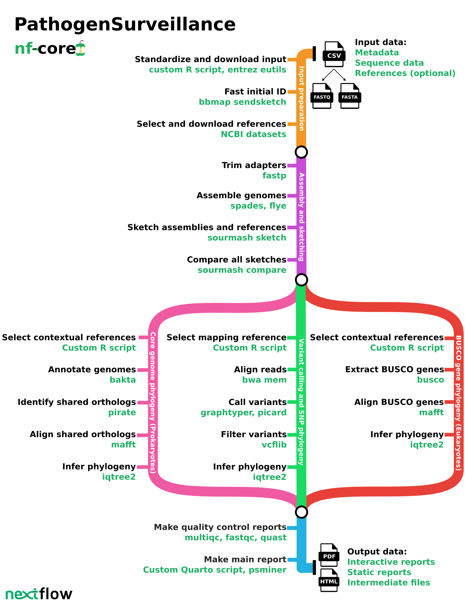

<h1>
  <picture>
    <source media="(prefers-color-scheme: dark)" srcset="docs/images/nf-core-pathogensurveillance_logo_dark.png">
    
  </picture>
</h1>

[](https://github.com/nf-core/pathogensurveillance/actions/workflows/ci.yml)
[](https://github.com/nf-core/pathogensurveillance/actions/workflows/linting.yml)[](https://nf-co.re/pathogensurveillance/results)[](https://doi.org/10.5281/zenodo.15757418)
[](https://www.nf-test.com)

[](https://www.nextflow.io/)
[](https://github.com/nf-core/tools/releases/tag/3.3.1)
[](https://docs.conda.io/en/latest/)
[](https://www.docker.com/)
[](https://sylabs.io/docs/)
[](https://cloud.seqera.io/launch?pipeline=https://github.com/nf-core/pathogensurveillance)

[](https://nfcore.slack.com/channels/pathogensurveillance)[](https://bsky.app/profile/nf-co.re)[](https://mstdn.science/@nf_core)[](https://www.youtube.com/c/nf-core)

## Introduction

**nf-core/pathogensurveillance** is a population genomics pipeline for pathogen identification, variant detection, and biosurveillance.
The pipeline accepts paths to raw reads for one or more organisms and creates reports in the form of an interactive HTML document.
Significant features include the ability to analyze unidentified eukaryotic and prokaryotic samples, creation of reports for multiple user-defined groupings of samples, automated discovery and downloading of reference assemblies from [NCBI RefSeq](https://www.ncbi.nlm.nih.gov/refseq/), and rapid initial identification based on k-mer sketches followed by a more robust multi gene phylogeny and SNP-based phylogeny.

The pipeline is built using [Nextflow](https://www.nextflow.io), a workflow tool to run tasks across multiple compute infrastructures in a very portable manner.
It uses Docker/Singularity/Conda to make installation trivial and results highly reproducible.
The [Nextflow DSL2](https://www.nextflow.io/docs/latest/dsl2.html) implementation of this pipeline uses one container per process which makes it much easier to maintain and update software dependencies.
Where appropriate, these processes have been submitted to and installed from [nf-core/modules](https://github.com/nf-core/modules) in order to make them available to all nf-core pipelines, and to everyone within the Nextflow community!

On release, automated continuous integration tests run the pipeline on a full-sized dataset on the AWS cloud infrastructure.
This ensures that the pipeline runs on AWS, has sensible resource allocation defaults set to run on real-world data sets, and permits the persistent storage of results to benchmark between pipeline releases and other analysis sources. The results obtained from the full-sized test can be viewed on the [nf-core website](https://nf-co.re/pathogensurveillance/results).

## Pipeline summary



## Quick start guide

> [!NOTE]
> If you are new to Nextflow and nf-core, please refer to [this page](https://nf-co.re/docs/usage/installation) on how to set-up Nextflow. Make sure to [test your setup](https://nf-co.re/docs/usage/introduction#how-to-run-a-pipeline) with `-profile test` before running the workflow on actual data.

Note that some form of configuration will be needed so that Nextflow knows how to fetch the required software.
This is usually done in the form of a config profile.
You can chain multiple config profiles in a comma-separated string.
In most cases you will include one profile that defines a tool to reproducibly install and use software needed by the pipeline.
This is typically one of `docker`, `singularity`, or `conda`.
Ideally `conda` should not be used unless `docker` or `singularity` cannot be used.

Profiles can also be used to store parameters for the pipeline, such as input data and pipeline options.
Before using you own data, consider trying out a small example dataset included with the pipeline as a profile.
Available test dataset profiles include:

- `test`: Test profile of 1 small genome used to run the pipeline as fast as possible for testing purposes.
- `test_serratia`: Test profile of 10 serratia isolates from Williams et al. 2022 (https://doi.org/10.1038/s41467-022-32929-2)
- `test_bordetella`: Test profile of 5 Bordetella pertussis isolates sequenced with with Illumina and Nanopore from Wagner et al. 2023
- `test_salmonella`: Test profile of 5 salmonella isolates from Hawkey et al. 2024 (https://doi.org/10.1038/s41467-024-54418-4)
- `test_boxwood_blight`: Test profile of 5 samples of the boxwood blight fungus Cylindrocladium buxicola from LeBlanc et al. 2020 (https://doi.org/10.1094/PHYTO-06-20-0219-FI)
- `test_mycobacteroides`: Test profile of 5 Mycobacteroides abscessus samples from Bronson et al. 2021 (https://doi.org/10.1038/s41467-021-25484-9)
- `test_bacteria`: Test profile of 10 mixed bacteria from various sources
- `test_klebsiella`: Test profile of 10 K. pneumoniae and related species from Holt et al. 2015 (https://doi.org/10.1073/pnas.1501049112)
- `test_small_genomes`: Test profile consisting of 6 samples from species with small genomes from various sources.

Adding `_full` to the end of any of these profiles will run a larger (often much larger) version of these datasets.

For example, you can run the `test_bacteria` profile with the `docker` profile:

```bash
nextflow run nf-core/pathogensurveillance -profile docker,test_bacteria -resume --outdir test_output
```

You can see the samplesheets used in these profiles here:

https://github.com/nf-core/test-datasets/tree/pathogensurveillance

To run your own input data, prepare a samplesheet as described in the [usage documentation](docs/usage/#samplesheet-input) section below and run the following command:

```bash
nextflow run nf-core/pathogensurveillance -profile <REPLACE WITH RUN TOOL> -resume --input <REPLACE WITH TSV/CSV> --outdir <REPLACE WITH OUTPUT PATH>
```

Where:

- `<REPLACE WITH RUN TOOL>` is one of `docker`, `singularity`, or `conda`
- `<REPLACE WITH TSV/CSV>` is the path to the input samplesheet
- `<REPLACE WITH OUTPUT PATH>` is the path to where to save the output

## Documentation

For more details and further functionality, please refer to the [usage documentation](https://nf-co.re/pathogensurveillance/usage) and the [parameter documentation](https://nf-co.re/pathogensurveillance/parameters).
To see the results of an example test run with a full size dataset refer to the [results](https://nf-co.re/pathogensurveillance/results) tab on the nf-core website pipeline page.
For more details about the output files and reports, please refer to the [output documentation](https://nf-co.re/pathogensurveillance/output).

## Credits

The following people contributed to the pipeline: Zachary S.L. Foster, Martha Sudermann, Camilo Parada-Rojas, Logan K. Blair, Fernanda I. Bocardo, Ricardo Alcalá-Briseño, Hung Phan, Nicholas C. Cauldron, Alexandra J. Weisberg, Jeff H. Chang, and Niklaus J. Grünwald.

## Funding

This work was supported by grants from USDA ARS (2072-22000-045-000-D) to NJG, USDA NIFA (2021-67021-34433; 2023-67013-39918) to JHC and NJG, as well as USDAR ARS NPDRS and FNRI and USDA APHIS to NJG.

## Contributions and Support

If you would like to contribute to this pipeline, please see the [contributing guidelines](.github/CONTRIBUTING.md).

For further information or help, don't hesitate to get in touch on the [Slack `#pathogensurveillance` channel](https://nfcore.slack.com/channels/pathogensurveillance) (you can join with [this invite](https://nf-co.re/join/slack)).

## Citations

If you use nf-core/pathogensurveillance for your analysis, please cite it using the following doi: [10.5281/zenodo.15757418](https://doi.org/10.5281/zenodo.15757418)

<!-- TODO nf-core: Add bibliography of tools and data used in your pipeline -->

An extensive list of references for the tools used by the pipeline can be found in the [`CITATIONS.md`](CITATIONS.md) file.

You can cite the `nf-core` publication as follows:

> **The nf-core framework for community-curated bioinformatics pipelines.**
>
> Philip Ewels, Alexander Peltzer, Sven Fillinger, Harshil Patel, Johannes Alneberg, Andreas Wilm, Maxime Ulysse Garcia, Paolo Di Tommaso & Sven Nahnsen.
>
> _Nat Biotechnol._ 2020 Feb 13. doi: [10.1038/s41587-020-0439-x](https://dx.doi.org/10.1038/s41587-020-0439-x).

<picture>
    <source media="(prefers-color-scheme: dark)" srcset="docs/images/combined_logos_dark.png">
    
</picture>
