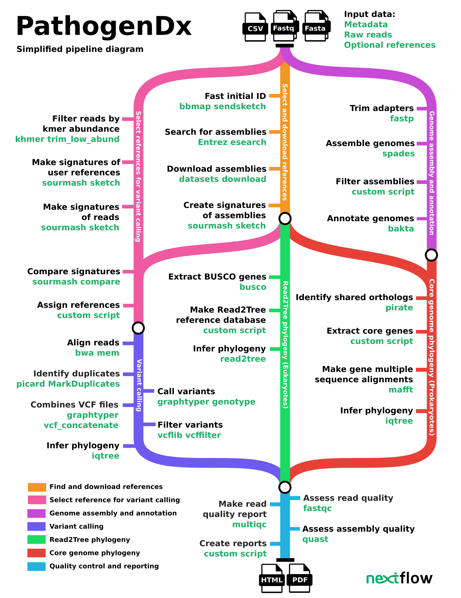

<picture>
  <source media="(prefers-color-scheme: dark)" srcset="docs/images/nf-core-pathogensurveillance_logo_dark.png">
  <source media="(prefers-color-scheme: light)" srcset="docs/images/nf-core-pathogensurveillance_logo_light.png">
  
</picture>


[](https://nf-co.re/pathogensurveillance/results)[](https://doi.org/10.5281/zenodo.XXXXXXX)

[](https://www.nextflow.io/)
[](https://docs.conda.io/en/latest/)
[](https://www.docker.com/)
[](https://sylabs.io/docs/)
[](https://tower.nf/launch?pipeline=https://github.com/nf-core/pathogensurveillance)

[](https://nfcore.slack.com/channels/pathogensurveillance)[](https://twitter.com/nf_core)[](https://www.youtube.com/c/nf-core)

## NOTE: THIS PROJECT IS UNDER DEVELOPMENT AND MAY NOT FUNCTION AS EXPECTED UNTIL THIS MESSAGE GOES AWAY

## Introduction

<!-- TODO nf-core: Write a 1-2 sentence summary of what data the pipeline is for and what it does -->

**nf-core/pathogensurveillance** is a population genomic pipeline for pathogen diagnosis, variant detection, and biosurveillance.
The pipeline accepts the paths to raw reads for one or more organisms (in the form of a CSV file) and creates reports in the form of interactive HTML reports or PDF documents.
Significant features include the ability to analyze unidentified eukaryotic and prokaryotic samples, creation of reports for multiple user-defined groupings of samples, automated discovery and downloading of reference assemblies from NCBI RefSeq, and rapid initial identification based on k-mer sketches followed by a more robust core genome phylogeny and SNP-based phylogeny.

The pipeline is built using [Nextflow](https://www.nextflow.io), a workflow tool to run tasks across multiple compute infrastructures in a very portable manner.
It uses Docker/Singularity containers making installation trivial and results highly reproducible.
The [Nextflow DSL2](https://www.nextflow.io/docs/latest/dsl2.html) implementation of this pipeline uses one container per process which makes it much easier to maintain and update software dependencies.
Where possible, these processes have been submitted to and installed from [nf-core/modules](https://github.com/nf-core/modules) in order to make them available to all nf-core pipelines, and to everyone within the Nextflow community!

<!-- TODO nf-core: Add full-sized test dataset and amend the paragraph below if applicable -->

On release, automated continuous integration tests run the pipeline on a full-sized dataset on the AWS cloud infrastructure.
This ensures that the pipeline runs on AWS, has sensible resource allocation defaults set to run on real-world data sets, and permits the persistent storage of results to benchmark between pipeline releases and other analysis sources.The results obtained from the full-sized test can be viewed on the [nf-core website](https://nf-co.re/pathogensurveillance/results).

## Pipeline summary



## Quick Start

1. Install [`Nextflow`](https://www.nextflow.io/docs/latest/getstarted.html#installation) (`>=21.10.3`)

2. Install any of [`Docker`](https://docs.docker.com/engine/installation/), [`Singularity`](https://www.sylabs.io/guides/3.0/user-guide/) (you can follow [this tutorial](https://singularity-tutorial.github.io/01-installation/)), [`Podman`](https://podman.io/), [`Shifter`](https://nersc.gitlab.io/development/shifter/how-to-use/) or [`Charliecloud`](https://hpc.github.io/charliecloud/) for full pipeline reproducibility _(you can use [`Conda`](https://conda.io/miniconda.html) both to install Nextflow itself and also to manage software within pipelines. Please only use it within pipelines as a last resort; see [docs](https://nf-co.re/usage/configuration#basic-configuration-profiles))_.

3. Download the pipeline and test it on a minimal dataset with a single command:

   ```bash
   nextflow run nf-core/pathogensurveillance -profile test,YOURPROFILE --outdir <OUTDIR> -resume
   ```

   Note that some form of configuration will be needed so that Nextflow knows how to fetch the required software. This is usually done in the form of a config profile (`YOURPROFILE` in the example command above). You can chain multiple config profiles in a comma-separated string.

   > - The pipeline comes with config profiles called `docker`, `singularity`, `podman`, `shifter`, `charliecloud` and `conda` which instruct the pipeline to use the named tool for software management. For example, `-profile test,docker`.
   > - Please check [nf-core/configs](https://github.com/nf-core/configs#documentation) to see if a custom config file to run nf-core pipelines already exists for your Institute. If so, you can simply use `-profile <institute>` in your command. This will enable either `docker` or `singularity` and set the appropriate execution settings for your local compute environment.
   > - If you are using `singularity`, please use the [`nf-core download`](https://nf-co.re/tools/#downloading-pipelines-for-offline-use) command to download images first, before running the pipeline. Setting the [`NXF_SINGULARITY_CACHEDIR` or `singularity.cacheDir`](https://www.nextflow.io/docs/latest/singularity.html?#singularity-docker-hub) Nextflow options enables you to store and re-use the images from a central location for future pipeline runs.
   > - If you are using `conda`, it is highly recommended to use the [`NXF_CONDA_CACHEDIR` or `conda.cacheDir`](https://www.nextflow.io/docs/latest/conda.html) settings to store the environments in a central location for future pipeline runs.

4. Start running your own analysis!

   <!-- TODO nf-core: Update the example "typical command" below used to run the pipeline -->

   ```bash
   nextflow run nf-core/pathogensurveillance --input samplesheet.csv --outdir <OUTDIR> -profile <docker/singularity/podman/shifter/charliecloud/conda/institute> -resume
   ```

You can also try running a small example dataset hosted with the source code using the following command (no need to download anything):

```
nextflow run nf-core/pathogensurveillance --input https://raw.githubusercontent.com/grunwaldlab/pathogensurveillance/master/test/data/metadata_small.csv --outdir test_out --download_bakta_db true -profile docker -resume
```


## Documentation

The nf-core/pathogensurveillance pipeline comes with documentation about the pipeline [usage](https://nf-co.re/pathogensurveillance/usage), [parameters](https://nf-co.re/pathogensurveillance/parameters) and [output](https://nf-co.re/pathogensurveillance/output).

### Input format

The primary input to the pipeline is a CSV (comma comma-separated value).
Columns can be in any order and unneeded columns can be left out or left blank.
Only a single column containing paths to raw sequence data or SRA (Sequence Read Archive) accessions is required and each sample can have values in different columns.
Any columns not recognized by `pathogensurveillance` will be ignored, allowing users to adapt existing sample metadata table by adding new columns.
Below is a description of each column used by `pathogensurveillance`:

* **sample_id**: The unique identifier for each sample. This will be used in file names to distinguish samples in the output. Any values that are not unique or contain characters that cannot appear in file names (\/:*?"<>| .) will be modified automatically. If not supplied, it will be inferred from the names of input data.
* **sample_name**: A human-readable label for the sample that is used in plots and tables. If not supplied, it will be inferred from the names of `sample_id`.
* **shortread_1**: Path to short read FASTQs like that produced by Illumina. When paired end sequencing is used, this is used for the forward read's data. This can be a local file path or a URL to an online location.
* **shortread_2**: Path to short read FASTQs like that produced by Illumina. This is used for the reverse read's data when paired-end sequencing is used. This can be a local file path or a URL to an online location.
* **nanopore**: Path to nanopore FASTQs. This can be a local file path or a URL to an online location.
* **sra**: Sequence Read Archive (SRA) accession numbers. These will be automatically downloaded and used as input.
* **reference_id**: The unique identifier for each user-defined reference genome. This will be used in file names to distinguish samples in the output. Any values that are not unique or contain characters that cannot appear in file names (\/:*?"<>| .) will be modified automatically. If not supplied, it will be inferred from the names of reference genomes.
* **reference_name**: A human-readable label for user-defined reference genomes that is used in plots and tables. If not supplied, it will be inferred from the names of reference_id.
* **reference**: Path to user-defined reference genomes for each sample. This can be a local file path or a URL to an online location.
* **reference_refseq**: RefSeq accession ID for a user-defined reference genome. These will be automatically downloaded and used as input.
* **report_group**: How to group samples into reports. For every unique value in this column a report will be generated. Samples can be assigned to multiple reports by separating group IDs by `;`. For example `all;subset` will put the sample in both `all` and `subset` report groups. If not included, all samples will be
* **color_by**: The names of user-specific columns (not usually any of the ones described here) containing variables to base the color of some plots by (e.g. the minimum spanning network). If not include, plots will not be colored.

## Credits

nf-core/pathogensurveillance was originally written by Zachary S.L. Foster, Martha Sudermann, Nicholas C. Cauldron, Fernanda I. Bocardo, Hung Phan, Jeff H. Chang, Niklaus J. Grünwald.

We thank the following people for their extensive assistance in the development of this pipeline:

<!-- TODO nf-core: If applicable, make list of people who have also contributed -->

## Contributions and Support

If you would like to contribute to this pipeline, please see the [contributing guidelines](.github/CONTRIBUTING.md).

For further information or help, don't hesitate to get in touch on the [Slack `#pathogensurveillance` channel](https://nfcore.slack.com/channels/pathogensurveillance) (you can join with [this invite](https://nf-co.re/join/slack)).

## Citations

<!-- TODO nf-core: Add citation for pipeline after first release. Uncomment lines below and update Zenodo doi and badge at the top of this file. -->
<!-- If you use  nf-core/pathogensurveillance for your analysis, please cite it using the following doi: [10.5281/zenodo.XXXXXX](https://doi.org/10.5281/zenodo.XXXXXX) -->

<!-- TODO nf-core: Add bibliography of tools and data used in your pipeline -->

An extensive list of references for the tools used by the pipeline can be found in the [`CITATIONS.md`](CITATIONS.md) file.

You can cite the `nf-core` publication as follows:

> **The nf-core framework for community-curated bioinformatics pipelines.**
>
> Philip Ewels, Alexander Peltzer, Sven Fillinger, Harshil Patel, Johannes Alneberg, Andreas Wilm, Maxime Ulysse Garcia, Paolo Di Tommaso & Sven Nahnsen.
>
> _Nat Biotechnol._ 2020 Feb 13. doi: [10.1038/s41587-020-0439-x](https://dx.doi.org/10.1038/s41587-020-0439-x).
